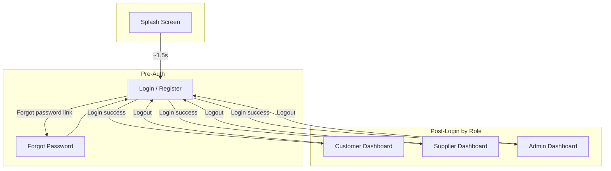
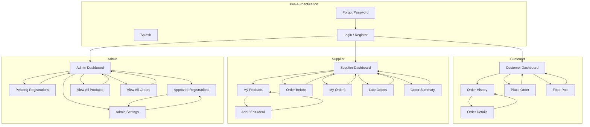
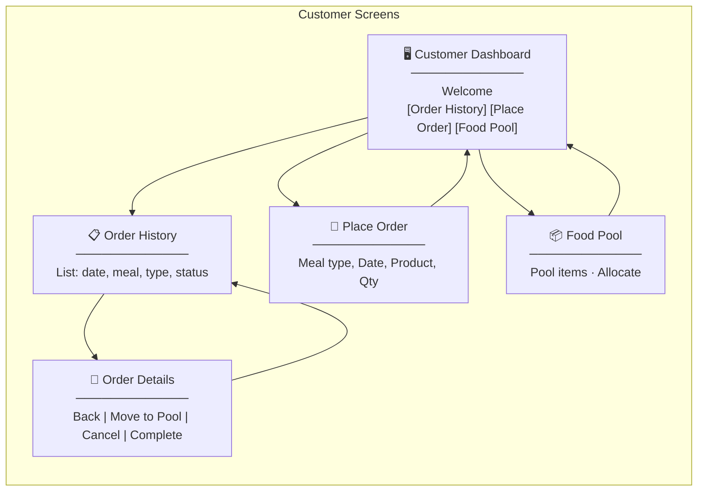
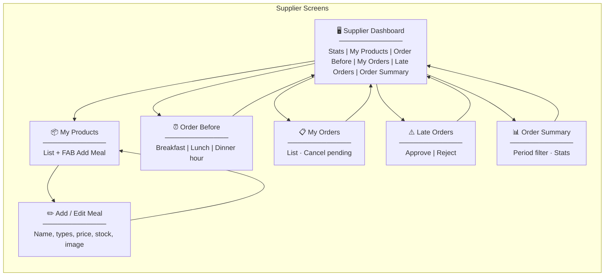
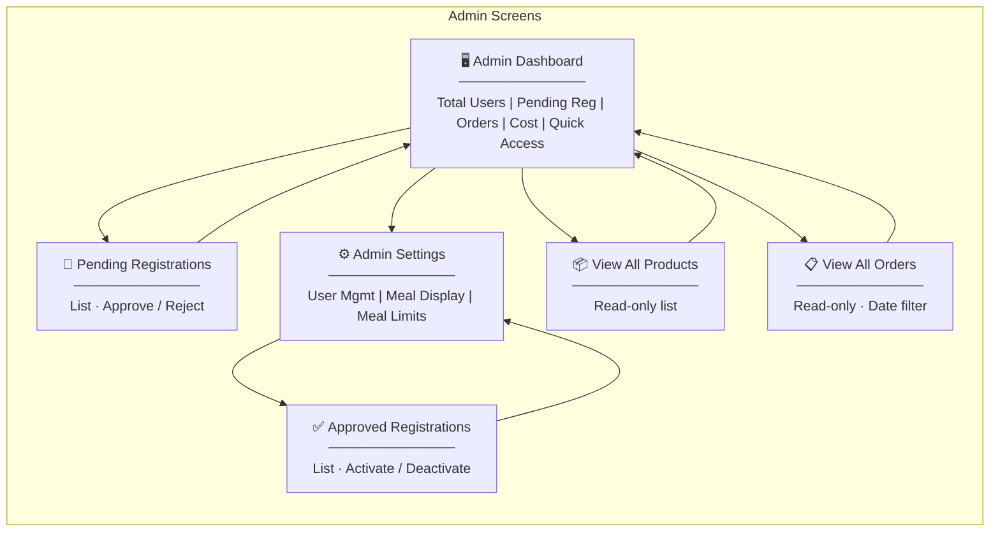
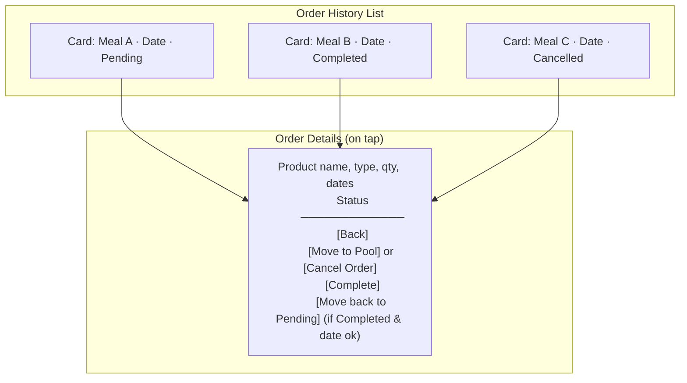
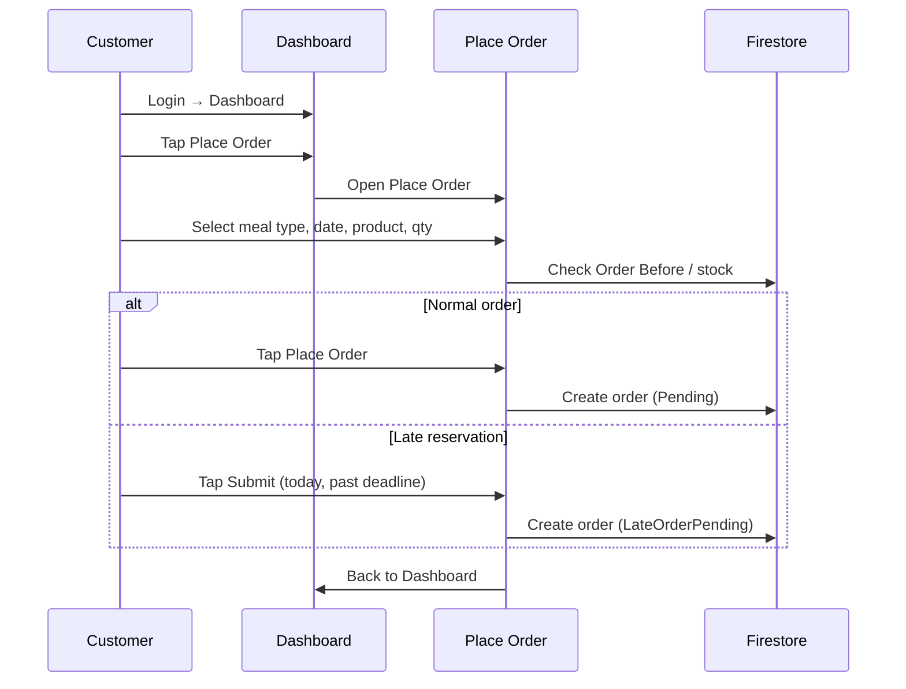
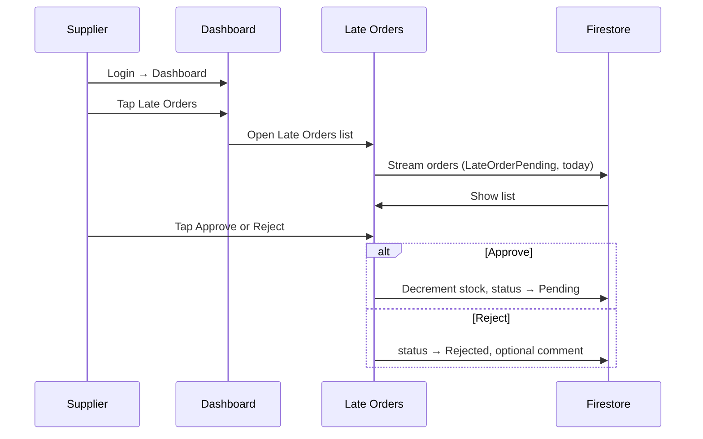

# Food Desk — Wireframe & Navigation Diagrams

This document provides wireframe-style diagrams and navigation flows for the Food Desk mobile app. Use a Mermaid-compatible viewer (e.g. VS Code with “Mermaid” extension, GitHub, or [mermaid.live](https://mermaid.live)) to render the diagrams.

---

## 1. High-Level App Flow



---

## 2. Full Application Sitemap (All Screens)



---

## 3. Customer Flow (Wireframe Navigation)



---

## 4. Supplier Flow (Wireframe Navigation)



---

## 5. Admin Flow (Wireframe Navigation)



---

## 6. Screen Wireframe Sketches (Layout)

### 6.1 Login / Register

```mermaid
block-beta
    columns 1
    block:header["App Bar: FoodDesk"]
    block:body["Body
    ─────────────
    [Login] [Register] toggle
    ─────────────
    Email: [____________]
    Password: [____________]
    Name: [____________]  (Register only)
    Role: [Customer ▼]    (Register only)
    ─────────────
    [    Login / Register    ]
    ─────────────
    Forgot password?
    Don't have account? Register"]
```

### 6.2 Customer Dashboard

```mermaid
block-beta
    columns 1
    block:appbar["App Bar: Dashboard | [History] [Logout]"]
    block:welc["Welcome, [Name]! | Choose an option below"]
    block:tiles["Card: Order History | View past and current orders"]
    block:tiles2["Card: Place Order | Browse and place new order"]
    block:tiles3["Card: Food Pool | X items in pool"]
```

### 6.3 Place Order Screen (Simplified)

```mermaid
block-beta
    columns 1
    block:bar["App Bar: Place Order"]
    block:meal["Meal type: [Breakfast ▼] [Lunch] [Dinner]"]
    block:date["Delivery date: [Date picker]"]
    block:countdown["Order before: HH:MM (countdown)"]
    block:prod["Product list | [Product 1] [Product 2] ..."]
    block:qty["Quantity: [ - ] 1 [ + ]"]
    block:btn["[ Place Order ]"]
```

### 6.4 Order History → Order Details



### 6.5 Supplier Dashboard Tiles

```mermaid
block-beta
    columns 2
    block:s1["My Products: N"]
    block:s2["My Orders: N"]
    block:s3["Total Stock: N"]
    block:s4["Revenue: Rs.X"]
    block:menu["Quick Access: My Products | Order Before | My Orders | Late Orders | Order Summary"]
```

### 6.6 Admin Dashboard Tiles

```mermaid
block-beta
    columns 2
    block:a1["Total Users: N"]
    block:a2["Pending Reg: N"]
    block:a3["Total Orders: N"]
    block:a4["Total Cost: Rs.X"]
    block:amenu["Order food | Pending Reg | Approved Reg | Settings | All Products | All Orders"]
```

---

## 7. Key User Journey: Customer Places Order



---

## 8. Key User Journey: Supplier Handles Late Order



---

## How to View / Export

- **VS Code / Cursor:** Install “Mermaid” or “Markdown Preview Mermaid Support” and open this file in preview (e.g. `Ctrl+Shift+V`).
- **GitHub:** Push the repo and view this file; Mermaid renders in the preview.
- **Online:** Copy a code block into [mermaid.live](https://mermaid.live) to view, edit, or export as PNG/SVG/PDF. Best for `block-beta` diagrams if your viewer doesn’t support them.
- **PDF:** Use “Markdown PDF” on this file, or export diagrams from mermaid.live and add to a document.

---

*Food Desk Wireframe & Navigation — February 2025*
